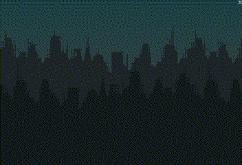
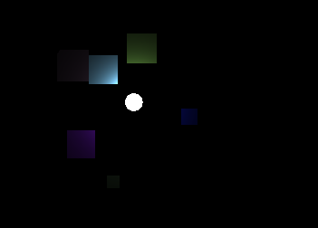

# love2d-demos
A collection of (not necessarily playable) demos written
in [Löve](https://love2d.org), mainly used to learn Lua and Löve.

All of the source code is licensed under the [GPLv3](LICENSE).
The artwork however is subject to miscellaneous licenses, which
are presented in the credits section of each demo (and possibly
within the demo itself.)

In order to play them, you have to have Löve installed. Then simply
download the ``.love``-file and open it with Löve.

## A word on GLES
If you want to play around with code that uses shaders, etc.
and use it on mobile, make sure to test it with GLES like
so:
```shell
$ LOVE_GRAPHICS_USE_OPENGLES=1 love game-dir
```

To make sure, that you're graphics card actually does use GLES,
here is an example, that **should fail** (complaining
about initializing x in line 1) if GLES is used and
should run fine otherwise:
```lua
function love.load()
    shader = love.graphics.newShader([[
        extern number x = 1.0;
        vec4 effect(vec4 color, Image tex, vec2 tc, vec2 sc){
            vec4 pixel = Texel(tex, tc);
            return pixel;
    ]])
end
```

## Thunderstorm


A little scene displaying a thunderstorm in a desolate city.
It's main focus is generating time-delayed sound and graphics.

**Löve-File:** [thunderstorm-v0.2.0.love](https://github.com/messersm/love2d-demos/releases/download/v0.2.0/thunderstorm-v0.2.0.love)

**Credits:** [Credits](thunderstorm/credits.md)

## A circle amongst squares


A little horror "game", in which you are a circle amongst squares.
This one has directional sound in it, so earphones may be a good idea.
It has some collision detection (using [bump](https://github.com/kikito/bump.lua)) and I played around with
a pixel shader and am quite pleased with the results. :-)

**How to play:** Move with w, a, s, d or the cursor keys. Press escape to exit.

**Löve-File:** [circle-amongst-squares-v0.2.1.love](https://github.com/messersm/love2d-demos/releases/download/v.0.2.1/circle-amongst-squares-v0.2.1.love)

**Credits:** [Credits](circle-amongst-squares/credits.md)
