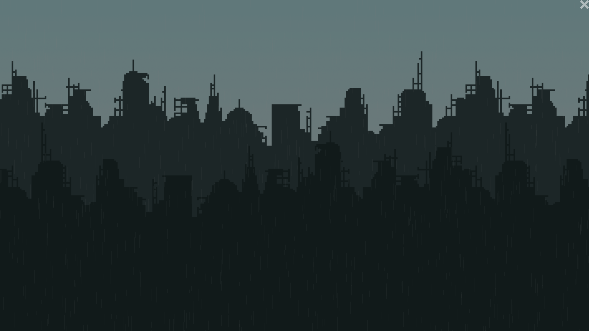

# love2d-demos
A collection of (not necessarily playable) demos written
in [Löve](https://love2d.org).

All of the source code is licensed under the [GPLv3](LICENSE).
The artwork however is subject to miscellaneous licenses, which
are presented in the credits section of each demo (and possibly
within the demo itself.)

In order to play them, you have to have Löve installed. Then simply
download the ``.love``-file and open it with Löve.

## Thunderstorm

A little scene displaying a thunderstorm in a desolate city.
It's main focus is generating time-delayed sound and graphics.

**Löve-File:** [thunderstorm.love](love/thunderstorm.love)

**Credits:** [Credits](thunderstorm/credits.md)
